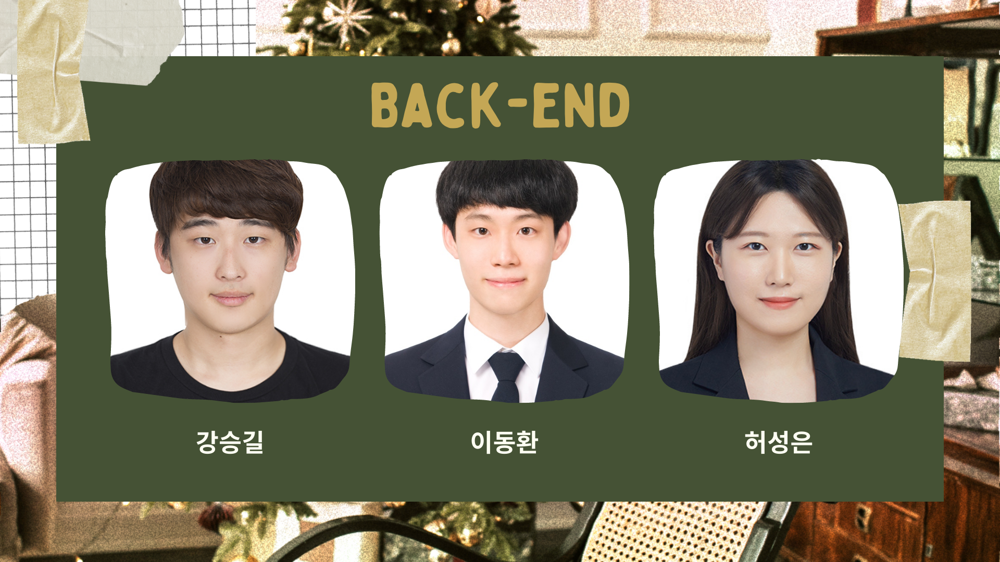

# :christmas_tree: SSANTA CLINIC 

## 1. PJT summary

- 팀명: 6T
- 프로젝트명: SSANTA CLINIC 
- 주제: 지친 ssafy 생들을 위로하는 크리스마스 분위기의 프로젝트
- 기간: 2022.10.11(화) ~ 2022.11.21(월)
- 발표: 2022.11.21(월)
- 조원: 김혜린, 강승길, 임완택, 엄윤규, 이동환, 허성은
- 사용 기술 스택:
  - 협업, 버전관리:  
  - 언어: 
  - 프레임워크: 
  - DB: 
  - 배포:    
  - 주요 기술: 

## 2. 팀원 소개

## 3. 프로젝트 산출물

### 와이어프레임

### API

-1.jpg)

-2.jpg)

### ERD

### 서비스 아키텍쳐

### 포팅 매뉴얼

https://a201.notion.site/722ef8c41ed54175a08400f625a4b329

### UCC

## 4. 발표자료

### [중간발표](https://www.canva.com/design/DAFPocdPgIg/G3GjTknSpg1ByThAPF492Q/edit?utm_content=DAFPocdPgIg&utm_campaign=designshare&utm_medium=link2&utm_source=sharebutton)

### [최종발표](https://www.canva.com/design/DAFR-Qm6zFo/KG4lyCrizU0bIzb_ZhjmeA/edit?utm_content=DAFR-Qm6zFo&utm_campaign=designshare&utm_medium=link2&utm_source=sharebutton)

## 5. 서비스 화면

### 로그인

### 산타 마을

### 마이룸 & 트리 꾸미기

### 미니게임

#### 1. 테트리스

#### 2. 기억력 게임

![[video-to-gif output image]](README.assets/ezgif-4-c5f038aebd.gif)

#### 3. 순발력 게임

![[video-to-gif output image]](README.assets/ezgif-4-be51bab1ae.gif)

### 산타의 편지

![[video-to-gif output image]](README.assets/ezgif-4-a79f8a84aa.gif)

### 트리 오너먼트 상점

![[video-to-gif output image]](README.assets/ezgif-4-45628b3bb1.gif)

### 어드벤트 캘린더

#### 1. 보내기

![[video-to-gif output image]](README.assets/ezgif-4-976a6e0c45.gif)

#### 2. 받기

![[video-to-gif output image]](README.assets/ezgif-4-a609313cc6.gif)

### 친구 기능

